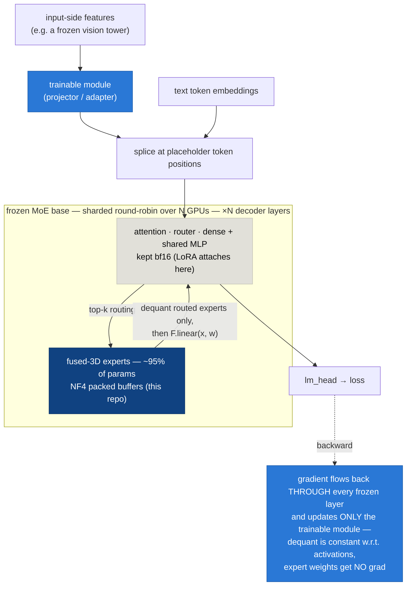

# nf4moe

**QLoRA-compatible NF4 quantization for fused-3D MoE expert tensors** — the `nn.Parameter` experts that no off-the-shelf weight-only quantizer reaches yet.

> 📄 Full writeup with diagrams: **[WRITEUP.md](WRITEUP.md)** (EN) · **[WRITEUP_KO.md](WRITEUP_KO.md)** (한국어) · also on **[Hugging Face](https://huggingface.co/mncai/nf4moe)**

Validated on **GLM-5.2 (743B total / 39B active)**: **~1.49 TB bf16 → ~414 GB**, one replica fits on 4×B200 (~103 GB/card), and the frozen base stays **differentiable** — gradients flow through all 743B quantized parameters to a trainable input-side module (projector / LoRA).

## The gap this fills

Modern `transformers` MoE checkpoints store experts as **fused 3D tensors**, not `nn.Linear` modules:

```python
gate_up_proj: nn.Parameter  # [E, 2*inter, hidden]   e.g. [256, 4096, 6144]
down_proj:    nn.Parameter  # [E, hidden, inter]     e.g. [256, 6144, 2048]
# used as: F.linear(x, gate_up_proj[expert_idx])
```

Weight-only quantizers (bitsandbytes, torchao, AWQ, GPTQ) are all **`nn.Linear` module-swap** designs, so they quantize attention/dense layers and silently skip the experts — **~95% of a big MoE's parameters**. This is an acknowledged, still-open ecosystem gap:

- bitsandbytes [#1849](https://github.com/bitsandbytes-foundation/bitsandbytes/issues/1849) (open) — 4-bit loading silently no-ops on fused experts (their demo: a "4-bit" Qwen3-30B-A3B takes 55.6 GB instead of ~15 GB)
- bitsandbytes [PR #1965 `Experts4bit`](https://github.com/bitsandbytes-foundation/bitsandbytes/pull/1965) — the official fix, **not merged** as of 2026-07-22
- Unsloth docs: *"Training MoE in 4-bit QLoRA isn't recommended — BitsandBytes doesn't support it."*

Inference-side 4-bit fused-MoE exists (GGUF, vLLM Marlin/AWQ/GPTQ) but is not differentiable. **This repo covers the empty intersection: 4-bit fused experts × training.** The trick is standard QLoRA logic ported to 3D tensors: expert weights are frozen, dequantization is constant w.r.t. activations, so `F.linear(x, dequant(w))` stays differentiable in `x`.

## Training structure at a glance

Solid arrows = forward pass, dashed arrow = the gradient's return trip. Only the blue box trains; the dark-blue expert stack is what this repo quantizes:



> 🔵 **blue = trained (bf16)** · ⬜ **gray = frozen bf16** · 🔷 **dark blue = frozen NF4 — the 95% no stock quantizer reaches**

## What's inside

| File | What it does |
|---|---|
| [`nf4moe/quant_moe.py`](nf4moe/quant_moe.py) | `QuantizedNaiveMoe` — behavior-preserving drop-in for the HF MoE block; per-expert NF4 (bnb functional API, blocksize 64), dequant-on-forward of **routed experts only**, `QuantState` device handling, batched host-sync |
| [`nf4moe/load_quant.py`](nf4moe/load_quant.py) | `quantize_experts_and_shard` — OOM-free load path (bf16→CPU, per-layer quantize→GPU with incremental free, round-robin shard, `accelerate.dispatch_model`) + `save_nf4_checkpoint` / `load_nf4_checkpoint` (explicit `QuantState` serialization; reload skips the ~100-min bf16 read + re-quant) |
| [`tests/smoke_nf4moe.py`](tests/smoke_nf4moe.py) | Real-743B validation: quantize + shard with zero CPU spill, finite forward loss, finite gradient through the frozen base |

## Usage

```python
import torch
from transformers import AutoModelForCausalLM
from nf4moe import quantize_experts_and_shard, save_nf4_checkpoint, load_nf4_checkpoint

# 1) bf16 → CPU first (a ~2 TB-RAM host holds the 1.4 TB model; no GPU pressure during load)
llm = AutoModelForCausalLM.from_pretrained(
    "zai-org/GLM-5.2", torch_dtype=torch.bfloat16,
    low_cpu_mem_usage=True, trust_remote_code=True)

# 2) NF4-quantize the fused experts layer-by-layer onto GPUs, shard, add dispatch hooks
llm, device_map = quantize_experts_and_shard(llm, [f"cuda:{i}" for i in range(8)])

# 3) (first run only) persist the quantized model — later runs load NF4 directly, ~3× faster cold start
save_nf4_checkpoint(llm, "./ckpt/glm5_nf4")
# llm, device_map = load_nf4_checkpoint("./ckpt/glm5_nf4", [f"cuda:{i}" for i in range(8)])
```

Then freeze the base, enable gradient checkpointing, and train whatever sits on top (projector, LoRA on the bf16 non-expert modules, …) exactly as in standard QLoRA. See the smoke test for the minimal end-to-end pattern.

```bash
python tests/smoke_nf4moe.py   # needs GLM-5.2 weights, ~2 TB host RAM, 4+ large GPUs
```

## Measured results (GLM-5.2, 8×B200 node)

| Component | Params | bf16 | nf4moe |
|---|---|---|---|
| Fused experts | ~700B | ~1.40 TB | **~336 GB** |
| Everything else (kept bf16) | ~39B | ~78 GB | ~78 GB |
| **Total** | **743B** | **~1.49 TB — doesn't fit** | **~414 GB** |

Validation ladder: synthetic MoE parity (grad cosine **0.99** vs bf16, 3.56× memory), 2-GPU real-class dispatch fwd+bwd, then real 743B — forward loss 6.80 (finite), projector grad-norm 405.8 (finite) **through the entire frozen quantized base**. The setup subsequently ran a month of VLM training (projector alignment, SFT with LoRA, LoRA merges served via vLLM) without the quantization ever being the bottleneck.

## Caveats — read before adopting

- **Written against GLM-5.2's `GlmMoeDsaNaiveMoe`.** Porting to another fused-MoE architecture = swap the module class lookup in `load_quant._naive_moe_cls()` and mirror that block's `forward` in `QuantizedNaiveMoe` (usually a few lines — the pattern is identical).
- **CUDA required** for bnb 4-bit kernels; the load path assumes a large-RAM host for the one-time bf16 read.
- **Not a fused kernel.** Dequant-on-forward costs a roughly fixed per-step tax (~2.5 s at 743B scale). Amortize it with **large, token-budget-packed batches** — that alone was a 5.5× throughput difference in our training.
- **Never let HF `Trainer` checkpoint the sharded quantized base** (plain `state_dict` drops `QuantState`; cross-device gather breaks). Use `save_strategy="no"` + save only your trainable modules; persist the base once with `save_nf4_checkpoint`.
- If you attach LoRA via PEFT on a custom architecture, **assert the trainable-parameter count** after wrapping — we hit a PEFT version silently dropping target modules on this model class.

## Status

Extracted from a concluded research program (June–July 2026); the code is working and frozen, not actively developed. When bitsandbytes lands `Experts4bit` and frameworks adopt it, use that instead — this repo exists because that path wasn't available yet, and it documents the practical hazards (`QuantState` movement/serialization, host-sync batching, Trainer checkpointing, the per-step dequant tax) an official implementation's docs should cover.

## License

[Apache-2.0](LICENSE) — **source code only**; see [NOTICE](NOTICE). Model weights (GLM-5.2 etc.) are governed by their owners' licenses.
