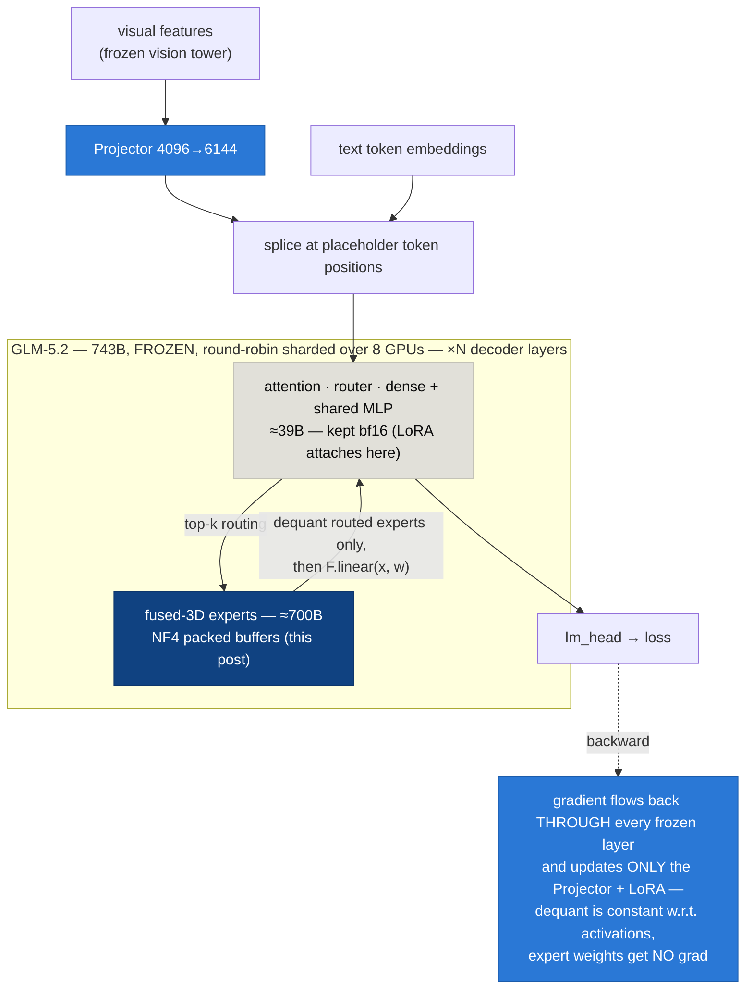
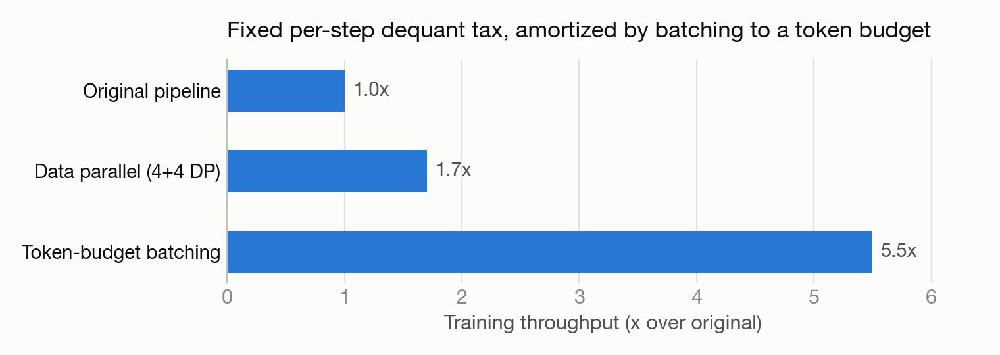

# QLoRA for a 743B Fused-MoE: Quantizing the 3D Expert Tensors No Library Reaches (Yet)

*How we NF4-quantized GLM-5.2's fused MoE experts by hand — ≈120 lines of code — to fit a 743B frozen base on a single node and train through it.*

> *한국어판: [WRITEUP_KO.md](WRITEUP_KO.md) · Also on Hugging Face: [huggingface.co/mncai/nf4moe](https://huggingface.co/mncai/nf4moe)*

> **TL;DR** — Modern `transformers` MoE checkpoints store experts as **fused 3D `nn.Parameter`s**, not `nn.Linear` modules. Every off-the-shelf weight-only quantizer (bitsandbytes, torchao, AWQ, GPTQ) works by *module swap*, so they silently skip the experts — which are **95% of the parameters**. Result: you cannot QLoRA a big fused-MoE today with stock tooling; bitsandbytes tracks this as [issue #1849](https://github.com/bitsandbytes-foundation/bitsandbytes/issues/1849), and the official fix ([PR #1965, `Experts4bit`](https://github.com/bitsandbytes-foundation/bitsandbytes/pull/1965)) is still open at the time of writing. We wrote a small **behavior-preserving drop-in module** that stores each expert in NF4 and dequantizes only the *routed* experts on the fly in forward. It shrinks GLM-5.2 from **≈1.49 TB to ≈414 GB**, keeps the frozen base **differentiable** (gradients flow through to a trainable projector/LoRA), and trained a full VLM program on 8×B200 — including a **5.5× throughput win** from token-budget batching on top. Code: **[github.com/genonai/nf4moe](https://github.com/genonai/nf4moe)** (Apache-2.0).

## The wall: three formats, zero training paths

We wanted to train a vision projector + LoRA on top of a **frozen** GLM-5.2 (743B-total / 39B-active MoE). The projector sits at the LLM's *input* (visual embeddings spliced into the token sequence), so the loss gradient must backpropagate **through the entire frozen base** to reach it. That imposes two hard requirements: the base must (a) fit on the node, and (b) stay differentiable.

Here is the whole training structure — solid arrows are the forward pass, the dashed arrow is the gradient's return trip. Only the blue boxes train; the dark-blue expert stack is what this post is about:



> 🔵 **blue = trained (bf16)** · ⬜ **gray = frozen bf16** · 🔷 **dark blue = frozen NF4 — the 95% no stock quantizer reaches**

| Format | Fits 8×B200 (≈1.46 TB)? | Backward? |
|---|:---:|:---:|
| bf16 original (≈1.49 TB) | ❌ | ✅ |
| FP8 serving checkpoint | ✅ | ❌ — block-FP8 matmul has no backward kernel |
| 4-bit weight-only (bnb / torchao / AWQ / GPTQ) | ❌ experts stay bf16 → CPU spill | — |

The third row is the surprising one, and it's not a bug in any one library.

## Why every quantizer misses 95% of the model

GLM-5.2's MoE block (`GlmMoeDsaNaiveMoe`) stores its 256 experts per layer as two **fused 3D tensors**:

```python
gate_up_proj: nn.Parameter  # [256, 2*2048, 6144]
down_proj:    nn.Parameter  # [256, 6144, 2048]
# used as: F.linear(x, gate_up_proj[expert_idx])
```

There is no `nn.Linear` here — just raw 3D parameters indexed per expert. Weight-only quantizers are all **`nn.Linear` module-swap** designs, so they quantize the attention and dense layers (≈39B params) and walk right past the experts (≈700B params, **95% of the model**). Hand them NVFP4 or NF4 config and you get a "quantized" model that is still ≈1.4 TB.

This is an ecosystem-wide, acknowledged gap, not our diagnosis:

- **bitsandbytes [#1849](https://github.com/bitsandbytes-foundation/bitsandbytes/issues/1849) (open)** — transformers v5's fused-expert layout broke the 4-bit path. The issue's own demo: Qwen3-30B-A3B loaded "in 4-bit" takes **55.6 GB instead of the expected ≈15 GB** (quantization silently skipped — the same symptom we hit as CPU spill).
- **Unsloth docs** — *"Training MoE in 4-bit QLoRA isn't recommended — BitsandBytes doesn't support it. This isn't specific to Unsloth."* Their recommendation is bf16 LoRA — which for 743B does not fit on a single node.
- **torchao** — has MXFP8 MoE *training* building blocks (grouped GEMM, differentiable), but that's 8-bit full-training infrastructure, not 4-bit weight-only QLoRA.
- Inference-side 4-bit fused-MoE exists (llama.cpp/GGUF, vLLM Marlin/AWQ/GPTQ) — but none of it is differentiable. **The QLoRA-training × fused-MoE intersection was empty.**

## The fix: dequant-on-forward for routed experts (≈120 lines)

The key observation is that QLoRA never needed anything fancy from the base weights: they're **frozen**, so we never need *their* gradients — only gradients **through** them, with respect to the activations. `F.linear(x, W)` is differentiable in `x` regardless of where `W` came from; the dequantization is a constant w.r.t. the activations. So the standard QLoRA trick ports directly to 3D tensors — someone just has to write the module.

We replaced each `GlmMoeDsaNaiveMoe` with a drop-in that keeps each expert's two 2D slices as NF4 packed buffers (bitsandbytes *functional* API — `quantize_4bit` / `dequantize_4bit`, blocksize 64 — no `nn.Linear` needed) and dequantizes **only the experts the router actually hit** (condensed here — the real module is ≈120 lines):

```python
class QuantizedNaiveMoe(nn.Module):
    """Behavior-preserving drop-in for GlmMoeDsaNaiveMoe, experts held as nf4."""

    def _deq(self, packed, state):
        # constant w.r.t. activations → F.linear(x, w) stays differentiable in x
        return bnbF.dequantize_4bit(packed, state, quant_type="nf4").to(self.compute_dtype)

    def forward(self, hidden_states, top_k_index, top_k_weights):
        final = torch.zeros_like(hidden_states)
        with torch.no_grad():
            expert_mask = F.one_hot(top_k_index, self.num_experts).permute(2, 1, 0)
            # one .tolist() sync instead of thousands of per-expert GPU→CPU stalls per step
            expert_hit = expert_mask.sum(dim=(-1, -2)).gt(0).nonzero().flatten().tolist()

        for e in expert_hit:
            top_k_pos, token_idx = torch.where(expert_mask[e])
            x = hidden_states[token_idx]
            gate, up = F.linear(x, self._deq(self.gup_packed[e], self.gup_state[e])).chunk(2, -1)
            h = F.linear(self.act_fn(gate) * up, self._deq(self.dn_packed[e], self.dn_state[e]))
            final.index_add_(0, token_idx, h * top_k_weights[token_idx, top_k_pos, None])
        return final
```

Two details that matter in practice:

- **`QuantState` travels with the module.** bnb's quant state (absmax, nested code) is not a buffer, so `.to(device)` won't move it. Override `_apply` to run the same function over each state's tensors — otherwise you get cross-device crashes the first time accelerate moves a layer.
- **Batch the host sync.** The naive per-expert `int(tensor)` loop costs thousands of GPU→CPU syncs per step across 256 experts × all MoE layers. One `.tolist()` on the hit-mask is numerically identical and removes the stall.

### Loading 1.4 TB without OOMing anything

The load path matters as much as the module (`load_quant.py`):

1. `from_pretrained` → **bf16 on CPU** (a 2 TB-RAM host holds it; zero GPU pressure).
2. Walk the decoder layers: quantize each layer's experts **directly onto their target GPU** (round-robin), then drop the bf16 3D tensor immediately — CPU memory frees incrementally as GPUs fill.
3. Move each layer's remaining bf16 params (attention, dense MLP, shared experts, router) to the same GPU.
4. `accelerate.dispatch_model` with the assembled `device_map` adds the cross-device hooks.

Resulting footprint:

| Component | Params | bf16 | nf4moe |
|---|---|---|---|
| Fused experts | ≈700B | ≈1.40 TB | **≈336 GB** |
| Everything else (attn, dense, shared experts, router, embed, head) | ≈39B | ≈78 GB | ≈78 GB (kept bf16) |
| **Total** | **743B** | **≈1.49 TB — doesn't fit** | **≈414 GB — 55–64 GB/GPU on 7 GPUs** |

At ≈414 GB, one replica actually fits on **4 GPUs** (≈103 GB/card) — which is what let us run **2-replica data parallelism on the 8-GPU node** later.

### Checkpointing the quantized model

A plain `state_dict()` silently drops bnb's `QuantState` → a reload gives garbage. We serialize each MoE module's packed bytes plus `QuantState.as_dict(packed=True)` explicitly, sharded per module. Payoff: subsequent runs skip the ≈100-minute bf16 read + re-quantization and load NF4 directly (≈3× faster cold start). Corollary: **never let HF `Trainer` checkpoint the sharded quantized base** (`save_strategy="no"` + a projector-only save callback) — it will either crash on the cross-device gather or write a broken multi-hundred-GB checkpoint.

## Does it actually train?

Verification ladder, cheapest first:

1. **Synthetic MoE parity** — nf4 vs bf16: output rel-err 0.15 (expected for NF4), **gradient cosine 0.99**, 3.56× memory reduction.
2. **Small real-class model, 2 GPUs** — accelerate-dispatched forward+backward, `inputs_embeds` gradient present and finite.
3. **Real 743B smoke** — ≈414 GB sharded with zero CPU spill; forward loss 6.80 (finite); **projector grad-norm 405.8, finite, through the entire frozen quantized base**.

On top of this base we then ran a month-long VLM program: stage-1 projector alignment (val loss 10.82 → 3.78 on LLaVA-Pretrain), stage-2 SFT with LoRA on attention + shared experts (best MMStar 58.87 for a frozen-base transplant), LoRA merges back into the FP8 checkpoint for vLLM serving at ≈97 tok/s, and even **LoRA applied directly to the fused 3D experts** (per-expert A/B on the 3D stacks — a lever no stock PEFT path offers either). The quantization was never the bottleneck again.

## Making it fast: the step tax and token-budget batching

One non-obvious property of dequant-on-forward at this scale: each training step pays a roughly **fixed ≈2.5 s dequantization tax** (every hit expert dequants once per step, roughly independent of batch size). With short SFT rows (median ≈438 tokens) and small batches, that tax dominates the step.

The fix is embarrassingly simple: **batch to a token budget, not a row count**. Packing ≈27 short rows per step amortizes the fixed tax and multiplies throughput:



Measured end-to-end on real training (≈10 h runs): **5.5× over the original pipeline, 3× over plain 2-replica data parallelism**. Micro-batching, by contrast, moves in the *wrong* direction under a fixed per-step tax — we measured that too.

## Practical gotchas (the part I wish someone had written for us)

- **PEFT target-module matching can silently drop modules** on custom architectures (we hit peft 0.19.1 dropping MLP targets on the quantized `glm_moe_dsa`). Force-match and then **assert the trainable-parameter count** — a LoRA that attaches to nothing trains "successfully" and learns nothing. Apply the same check at eval-time adapter load.
- **NF4 quantization requires CUDA** (bnb kernels) — plan the load path around it.
- Pin your stack: we validated on torch 2.11.0+cu128 ↔ torchvision 0.26.0, bitsandbytes 0.49, torchao 0.17. A torch downgrade breaks `torchvision` import, which takes `transformers.AutoProcessor` down with it.
- On a shared box, the bf16 CPU read is disk-bound: ≈41 min quiet, 2.5× worse under contention. The NF4 checkpoint reload (previous section) is what makes iteration tolerable.

## What this is — and isn't

Honest positioning: **this is not a new quantization method.** It is QLoRA (Dettmers et al., 2023) applied to fused 3D expert tensors — conceptually obvious, and the reason it works (dequant is constant w.r.t. activations) is one sentence. The contribution is *timing and evidence*: the mainstream stack could not do this at the time of writing, the gap is acknowledged in the libraries' own trackers, and we show it working at 743B scale on one node, with the load path, checkpoint format, sync patterns, and throughput fixes that turn the one-liner into a usable training setup.

The window is closing by design: when bitsandbytes lands `Experts4bit` ([PR #1965](https://github.com/bitsandbytes-foundation/bitsandbytes/pull/1965)) and frameworks adopt it, this becomes table stakes — which is exactly what should happen. Until then, if you need to QLoRA a big fused-MoE, the recipe above is ≈120 lines and works today. If you're building the official version: the `QuantState` device handling, the routed-expert host-sync batching, the Trainer-checkpoint hazard, and the fixed per-step dequant tax (→ token-budget batching) are the four things we'd want the docs to mention.

## Links

- bitsandbytes issue [#1849](https://github.com/bitsandbytes-foundation/bitsandbytes/issues/1849) · PR [#1965 (Experts4bit)](https://github.com/bitsandbytes-foundation/bitsandbytes/pull/1965)
- QLoRA: [Dettmers et al., 2023](https://arxiv.org/abs/2305.14314)
- Code: **[github.com/genonai/nf4moe](https://github.com/genonai/nf4moe)** — `quant_moe.py` (the drop-in module), `load_quant.py` (OOM-free loader/dispatch + NF4 checkpointing), `tests/smoke_nf4moe.py` (real-743B validation). Apache-2.0, self-contained.
- The broader research program this enabled (vision transplant onto the frozen 743B, and where its ceiling turned out to be) is written up separately.

*Experiments ran June–July 2026 on a single 8×B200 node. Library states (bnb #1849/#1965 open, Unsloth guidance, torchao scope) were re-verified on 2026-07-22.*
