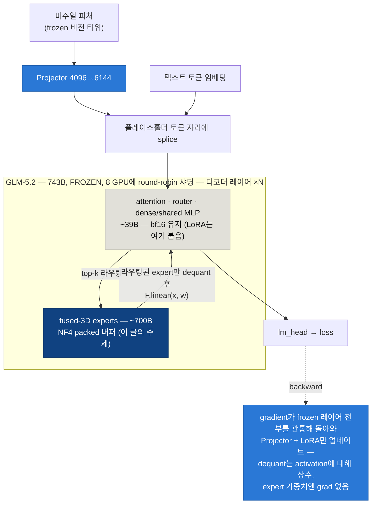
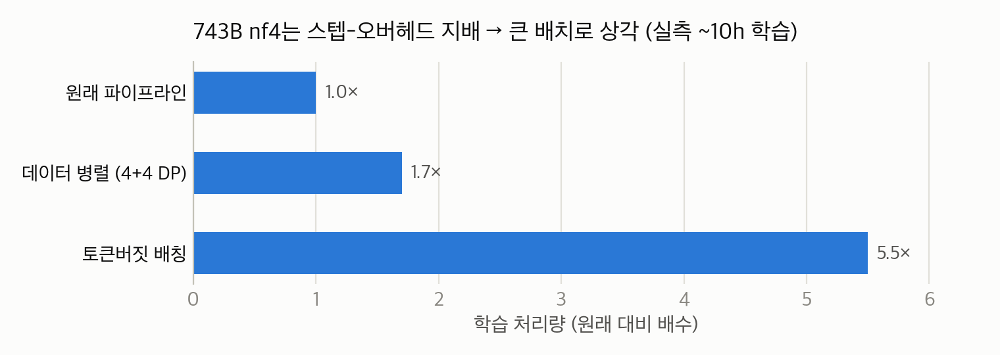

# 743B fused-MoE를 QLoRA하기: 아직 어떤 라이브러리도 못 건드리는 3D expert 텐서 양자화

*GLM-5.2의 fused MoE expert를 ~120줄 코드로 직접 NF4 양자화해서, 743B frozen base를 단일 노드에 올리고 그 위로 학습까지 시킨 이야기.*

> *English version: [WRITEUP.md](WRITEUP.md) · Hugging Face: [huggingface.co/mncai/nf4moe](https://huggingface.co/mncai/nf4moe)*

> **TL;DR** — 최신 `transformers`의 MoE 체크포인트는 expert를 `nn.Linear` 모듈이 아니라 **fused 3D `nn.Parameter`** 로 저장합니다. 그런데 기성 weight-only 양자화기(bitsandbytes, torchao, AWQ, GPTQ)는 전부 *모듈 교체(module swap)* 방식이라 이 expert들을 조용히 건너뜁니다 — **전체 파라미터의 95%** 인데도요. 결과: 오늘날 큰 fused-MoE는 기성 도구로 QLoRA가 **안 됩니다**. bitsandbytes도 이를 [이슈 #1849](https://github.com/bitsandbytes-foundation/bitsandbytes/issues/1849)로 추적 중이고, 공식 해결책([PR #1965, `Experts4bit`](https://github.com/bitsandbytes-foundation/bitsandbytes/pull/1965))은 이 글을 쓰는 시점에 아직 머지되지 않았습니다. 우리는 각 expert를 NF4로 저장하고 forward에서 **라우팅된 expert만** 즉석 dequantize하는 **동작 보존 드롭인 모듈**을 직접 작성했습니다. GLM-5.2가 **~1.49 TB → ~414 GB** 로 줄었고, frozen base는 **미분 가능**하게 유지되며(gradient가 학습 대상 projector/LoRA까지 관통), 8×B200에서 VLM 학습 프로그램 전체를 돌렸습니다 — 토큰버짓 배칭으로 얹은 **5.5× 처리량 개선**까지 포함해서요. 코드: **[github.com/genonai/nf4moe](https://github.com/genonai/nf4moe)** (Apache-2.0).

## 벽: 포맷은 셋, 학습 경로는 없음

우리는 **frozen** GLM-5.2(총 743B / 활성 39B MoE) 위에 비전 projector + LoRA를 학습시키려 했습니다. projector는 LLM의 *입력단*에 있어서(비주얼 임베딩을 토큰 시퀀스에 splice), loss gradient가 projector에 도달하려면 **frozen base 전체를 역전파로 관통**해야 합니다. 즉 base는 (a) 노드에 들어가야 하고 (b) 미분 가능해야 합니다.

학습 구조 전체를 그림 하나로 보면 이렇습니다 — 실선이 forward, 점선이 gradient의 귀환 경로입니다. 파란 상자만 학습되고, 진파랑 expert 스택이 이 글의 주인공입니다:



> 🔵 **파랑 = 학습됨 (bf16)** · ⬜ **회색 = frozen bf16** · 🔷 **진파랑 = frozen NF4 — 기성 양자화기가 못 닿는 95%**

| 포맷 | 8×B200(~1.46 TB)에 들어감? | Backward? |
|---|:---:|:---:|
| bf16 원본 (~1.49 TB) | ❌ | ✅ |
| FP8 서빙 체크포인트 | ✅ | ❌ — block-FP8 matmul에 backward 커널 없음 |
| 4-bit weight-only (bnb / torchao / AWQ / GPTQ) | ❌ expert가 bf16로 남아 CPU spill | — |

셋째 줄이 의외의 대목인데, 어느 한 라이브러리의 버그가 아닙니다.

## 왜 모든 양자화기가 모델의 95%를 놓치는가

GLM-5.2의 MoE 블록(`GlmMoeDsaNaiveMoe`)은 레이어당 256개 expert를 **fused 3D 텐서** 두 개로 저장합니다:

```python
gate_up_proj: nn.Parameter  # [256, 2*2048, 6144]
down_proj:    nn.Parameter  # [256, 6144, 2048]
# 사용: F.linear(x, gate_up_proj[expert_idx])
```

여기엔 `nn.Linear`가 없습니다 — expert 인덱스로 슬라이스하는 날것의 3D 파라미터뿐입니다. weight-only 양자화기는 전부 **`nn.Linear` 모듈 교체** 설계라서, attention과 dense 레이어(~39B)는 양자화하고 expert(~700B, **모델의 95%**)는 그냥 지나칩니다. NVFP4든 NF4든 설정을 줘도 "양자화된" 모델이 여전히 ~1.4 TB입니다.

이건 우리 진단이 아니라 생태계 전체가 공인한 갭입니다:

- **bitsandbytes [#1849](https://github.com/bitsandbytes-foundation/bitsandbytes/issues/1849) (open)** — transformers v5의 fused-expert 레이아웃이 4-bit 경로를 깨뜨림. 이슈 자체의 데모: Qwen3-30B-A3B를 "4-bit"로 로드하면 기대치 ~15 GB 대신 **55.6 GB** (양자화가 조용히 스킵됨 — 우리가 겪은 CPU spill과 동일 증상).
- **Unsloth 문서** — *"Training MoE in 4-bit QLoRA isn't recommended — BitsandBytes doesn't support it. This isn't specific to Unsloth."* 이들의 권장은 bf16 LoRA인데, 743B에선 단일 노드에 안 들어갑니다.
- **torchao** — MXFP8 MoE *학습* 빌딩블록(grouped GEMM, 미분 가능)은 있지만, 그건 8-bit 풀트레이닝 인프라지 4-bit weight-only QLoRA가 아닙니다.
- 추론 쪽 4-bit fused-MoE는 존재하지만(llama.cpp/GGUF, vLLM Marlin/AWQ/GPTQ) 미분이 안 됩니다. **QLoRA 학습 × fused-MoE의 교집합은 비어 있었습니다.**

## 해법: 라우팅된 expert만 dequant-on-forward (~120줄)

핵심 관찰은, QLoRA가 base 가중치에게 요구하는 게 애초에 대단하지 않다는 겁니다. base는 **frozen**이라 *가중치의* gradient는 필요 없고, 가중치를 **관통하는** gradient — 즉 activation에 대한 미분만 있으면 됩니다. `F.linear(x, W)`는 `W`가 어디서 왔든 `x`에 대해 미분 가능하고, dequantization은 activation 입장에선 상수입니다. 그러니 표준 QLoRA 트릭이 3D 텐서에 그대로 이식됩니다 — 누군가 그 모듈을 작성하기만 하면요.

우리는 각 `GlmMoeDsaNaiveMoe`를, expert별 2D 슬라이스 두 장을 NF4 packed 버퍼로 보관하고(bitsandbytes *functional* API — `quantize_4bit` / `dequantize_4bit`, blocksize 64 — `nn.Linear` 불필요) **라우터가 실제로 때린 expert만** dequantize하는 드롭인으로 교체했습니다 (아래는 압축본 — 실제 모듈은 ~120줄):

```python
class QuantizedNaiveMoe(nn.Module):
    """GlmMoeDsaNaiveMoe의 동작 보존 드롭인 — expert를 nf4로 보관."""

    def _deq(self, packed, state):
        # activation에 대해 상수 → 아래 F.linear(x, w)는 x에 대해 미분 가능
        return bnbF.dequantize_4bit(packed, state, quant_type="nf4").to(self.compute_dtype)

    def forward(self, hidden_states, top_k_index, top_k_weights):
        final = torch.zeros_like(hidden_states)
        with torch.no_grad():
            expert_mask = F.one_hot(top_k_index, self.num_experts).permute(2, 1, 0)
            # expert별 GPU→CPU 동기화 수천 번 대신 .tolist() 한 번
            expert_hit = expert_mask.sum(dim=(-1, -2)).gt(0).nonzero().flatten().tolist()

        for e in expert_hit:
            top_k_pos, token_idx = torch.where(expert_mask[e])
            x = hidden_states[token_idx]
            gate, up = F.linear(x, self._deq(self.gup_packed[e], self.gup_state[e])).chunk(2, -1)
            h = F.linear(self.act_fn(gate) * up, self._deq(self.dn_packed[e], self.dn_state[e]))
            final.index_add_(0, token_idx, h * top_k_weights[token_idx, top_k_pos, None])
        return final
```

실전에서 중요한 디테일 두 가지:

- **`QuantState`는 모듈과 함께 이동해야 합니다.** bnb의 quant state(absmax, 중첩 code)는 버퍼가 아니라서 `.to(device)`가 옮겨주지 않습니다. `_apply`를 오버라이드해 각 state의 텐서에도 같은 함수를 적용하세요 — 안 그러면 accelerate가 레이어를 옮기는 첫 순간 cross-device 크래시가 납니다.
- **호스트 동기화를 배칭하세요.** expert마다 `int(tensor)`를 부르는 순진한 루프는 256 expert × 전체 MoE 레이어에 걸쳐 스텝당 수천 번의 GPU→CPU 동기화를 유발합니다. hit 마스크에 `.tolist()` 한 번이면 수치적으로 동일하고 스톨이 사라집니다.

### 1.4 TB를 아무 데도 OOM 없이 로드하기

로드 경로가 모듈만큼 중요합니다 (`load_quant.py`):

1. `from_pretrained` → **bf16을 CPU로** (2 TB RAM 호스트면 수용; GPU 부담 전무).
2. 디코더 레이어를 순회하며 각 레이어의 expert를 **목적지 GPU 위에서 바로 양자화**(round-robin)하고, bf16 3D 텐서는 즉시 폐기 — GPU가 차는 만큼 CPU 메모리가 점진적으로 해제됩니다.
3. 레이어의 나머지 bf16 파라미터(attention, dense MLP, shared expert, router)를 같은 GPU로 이동.
4. 조립된 `device_map`으로 `accelerate.dispatch_model` → cross-device hook 추가.

결과 메모리:

| 구성 | 파라미터 | bf16 | nf4moe |
|---|---|---|---|
| fused expert | ~700B | ~1.40 TB | **~336 GB** |
| 나머지 전부 (attn·dense·shared expert·router·embed·head) | ~39B | ~78 GB | ~78 GB (bf16 유지) |
| **합계** | **743B** | **~1.49 TB — 안 들어감** | **~414 GB — 7 GPU에서 카드당 55–64 GB** |

~414 GB면 replica 하나가 **GPU 4장**(카드당 ~103 GB)에 들어갑니다 — 덕분에 나중에 8장 노드에서 **2-replica 데이터 병렬**을 돌릴 수 있었습니다.

### 양자화된 모델의 체크포인팅

일반 `state_dict()`는 bnb의 `QuantState`를 조용히 누락시킵니다 → 리로드하면 쓰레기가 나옵니다. 우리는 각 MoE 모듈의 packed 바이트와 `QuantState.as_dict(packed=True)`를 모듈 단위 샤드로 명시 직렬화했습니다. 보상: 이후 런은 ~100분짜리 bf16 읽기 + 재양자화를 건너뛰고 NF4를 직접 로드합니다(콜드 스타트 ~3× 단축). 따름정리: **HF `Trainer`가 샤딩된 양자화 base를 체크포인트하게 두면 절대 안 됩니다** (`save_strategy="no"` + 학습 모듈만 저장하는 콜백) — cross-device gather에서 크래시하거나 수백 GB짜리 깨진 체크포인트를 쓰게 됩니다.

## 진짜 학습이 되나?

검증 사다리, 싼 것부터:

1. **합성 MoE parity** — nf4 vs bf16: 출력 rel-err 0.15(NF4로선 기대 범위), **gradient cosine 0.99**, 메모리 3.56× 절감.
2. **실제 클래스의 소형 모델, 2 GPU** — accelerate dispatch 상태로 forward+backward, `inputs_embeds` gradient 존재·유한.
3. **실물 743B 스모크** — ~414 GB 샤딩, CPU spill 0; forward loss 6.80(유한); **projector grad-norm 405.8, 유한, frozen 양자화 base 전체를 관통**.

이 base 위에서 이후 한 달짜리 VLM 프로그램을 돌렸습니다: stage-1 projector 정렬(LLaVA-Pretrain에서 val loss 10.82 → 3.78), attention + shared expert LoRA를 붙인 stage-2 SFT(frozen-base 이식 기준 최고 MMStar 58.87), LoRA를 FP8 체크포인트에 머지해 vLLM으로 ~97 tok/s 서빙, 심지어 **fused 3D expert에 직접 붙이는 LoRA**(3D 스택 위 expert별 A/B — 이것도 기성 PEFT엔 없는 경로)까지. 양자화가 다시 병목이 된 적은 없습니다.

## 빠르게 만들기: 스텝 세금과 토큰버짓 배칭

이 스케일의 dequant-on-forward에는 비자명한 성질이 하나 있습니다: 매 학습 스텝이 대략 **고정 ~2.5초의 dequantization 세금**을 냅니다(hit된 expert는 스텝당 한 번 dequant — 배치 크기와 거의 무관). 짧은 SFT 행(중앙값 ~438 토큰)과 작은 배치에서는 이 세금이 스텝을 지배합니다.

해법은 민망할 만큼 단순합니다: **행 수가 아니라 토큰 예산으로 배칭**하세요. 짧은 행 ~27개를 한 스텝에 패킹하면 고정 세금이 상각되며 처리량이 배가됩니다:



실학습(~10시간 런) 엔드투엔드 실측: **원래 파이프라인 대비 5.5×, 순수 2-replica 데이터 병렬 대비 3×**. 반대로 마이크로배칭은 고정 스텝 세금 아래에선 *역방향*입니다 — 그것도 실측했습니다.

## 실전 함정들 (누가 미리 써줬으면 했던 부분)

- **PEFT의 target-module 매칭이 커스텀 아키텍처에서 모듈을 조용히 떨굴 수 있습니다** (우리는 peft 0.19.1이 양자화된 `glm_moe_dsa`에서 MLP 타깃을 떨구는 걸 겪었습니다). 강제 매칭한 뒤 **trainable 파라미터 수를 assert** 하세요 — 아무 데도 안 붙은 LoRA는 "성공적으로" 학습되면서 아무것도 안 배웁니다. eval에서 어댑터 로드할 때도 같은 체크를 거세요.
- **NF4 양자화는 CUDA 필수** (bnb 커널) — 로드 경로를 그에 맞춰 설계하세요.
- 스택을 고정하세요: 우리는 torch 2.11.0+cu128 ↔ torchvision 0.26.0, bitsandbytes 0.49, torchao 0.17에서 검증했습니다. torch가 다운그레이드되면 `torchvision` import가 깨지고, `transformers.AutoProcessor`까지 함께 무너집니다.
- 공유 장비에서 bf16 CPU 읽기는 디스크 바운드입니다: 한가할 때 ~41분, 경합 시 2.5배. 앞 절의 NF4 체크포인트 리로드가 반복 작업을 견딜 만하게 만들어 줍니다.

## 이것이 무엇이고 — 무엇이 아닌가

정직한 포지셔닝: **이건 새로운 양자화 방법이 아닙니다.** QLoRA(Dettmers et al., 2023)를 fused 3D expert 텐서에 적용한 것뿐이고 — 개념적으로 자명하며, 작동하는 이유(dequant는 activation에 대해 상수)는 한 문장입니다. 기여는 *타이밍과 증거*입니다: 이 글을 쓰는 시점에 주류 스택으로는 이게 안 되고, 그 갭은 라이브러리들 자신의 트래커가 인정하고 있으며, 우리는 743B 스케일 단일 노드에서 실제로 작동함을 — 한 줄짜리 아이디어를 쓸 만한 학습 셋업으로 만들어주는 로드 경로, 체크포인트 포맷, 동기화 패턴, 처리량 수정까지 포함해 — 보였습니다.

이 창은 설계상 닫히는 중입니다: bitsandbytes가 `Experts4bit`([PR #1965](https://github.com/bitsandbytes-foundation/bitsandbytes/pull/1965))를 머지하고 프레임워크들이 채택하면 이건 table stakes가 됩니다 — 그리고 그게 마땅한 일입니다. 그때까지, 큰 fused-MoE를 QLoRA해야 한다면 위 레시피는 ~120줄이고 오늘 작동합니다. 공식 버전을 만들고 계시다면: `QuantState` 디바이스 처리, 라우팅-expert 호스트싱크 배칭, Trainer 체크포인트 함정, 고정 스텝 dequant 세금(→ 토큰버짓 배칭) — 이 넷은 문서에 꼭 있었으면 하는 항목입니다.

## 링크

- bitsandbytes 이슈 [#1849](https://github.com/bitsandbytes-foundation/bitsandbytes/issues/1849) · PR [#1965 (Experts4bit)](https://github.com/bitsandbytes-foundation/bitsandbytes/pull/1965)
- QLoRA: [Dettmers et al., 2023](https://arxiv.org/abs/2305.14314)
- 코드: **[github.com/genonai/nf4moe](https://github.com/genonai/nf4moe)** — `quant_moe.py`(드롭인 모듈), `load_quant.py`(OOM-free 로더/디스패치 + NF4 체크포인팅), `tests/smoke_nf4moe.py`(실물 743B 검증). Apache-2.0, 자기완결.
- 이 셋업이 가능케 한 더 큰 연구 프로그램(frozen 743B 위 비전 이식, 그리고 그 상한이 어디였는지)은 별도로 정리되어 있습니다.

*실험은 2026년 6–7월, 단일 8×B200 노드에서 수행했습니다. 라이브러리 상태(bnb #1849/#1965 open, Unsloth 가이드, torchao 범위)는 2026-07-22에 재확인했습니다.*
